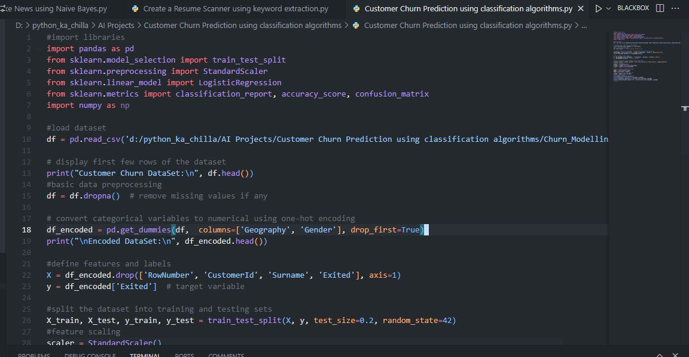
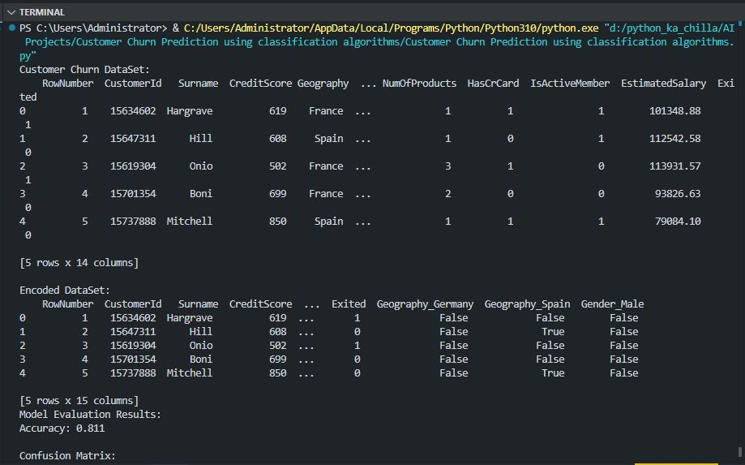

# 📉 Customer Churn Prediction using Classification Algorithms 🤖  
    

<p align="center">
  
</p>

🚀 This project builds a **machine learning model** to predict customer churn using **Logistic Regression**. It preprocesses the dataset, handles categorical variables via one‑hot encoding, scales features, trains a classifier, and evaluates performance using accuracy, confusion matrix, and classification report. The dataset used is the popular [Bank Customer Churn dataset](https://www.kaggle.com/datasets/shubh0799/churn-modelling) from Kaggle.

---

## ✨ Key Features  
📊 **Data Exploration** – Displays dataset info and first few rows  
⚙️ **Preprocessing** – Handles missing values, one‑hot encoding of categorical features  
📈 **Feature Scaling** – Standardizes features using `StandardScaler`  
🧠 **Logistic Regression** – Simple yet powerful classification algorithm  
📉 **Model Evaluation** – Accuracy, confusion matrix, and detailed classification report  
🔄 **Train‑Test Split** – Splits data into training and testing sets (80/20)  

---

## 🧠 Tech Stack  
- **Language:** Python 🐍  
- **Libraries:** pandas 🐼, scikit-learn 🔢, numpy 🔢  
- **Model:** Logistic Regression  
- **Preprocessing:** One‑Hot Encoding, StandardScaler  
- **Evaluation:** Confusion Matrix, Classification Report  

---

## 📦 Installation  

```bash
git clone https://github.com/SayabArshad/Customer-Churn-Prediction-ML.git
cd Customer-Churn-Prediction-ML
pip install pandas scikit-learn numpy
````

⚙️ Note: You need to download the Churn_Modelling.csv dataset from Kaggle and place it in the project folder.

---

##  ▶️ Usage

Run the main script:

```bash
python "Customer Churn Prediction using classification algorithms.py"
```

The script will:

Load the dataset.

Display basic info and encoded features.

Split the data, scale features, and train a Logistic Regression model.

Print accuracy, confusion matrix, and classification report.

---

##  📁 Project Structure

```
Customer-Churn-Prediction-ML/
│-- Customer Churn Prediction using classification algorithms.py   
│-- Churn_Modelling.csv                                             
│-- README.md                                                       
│-- assets/                                                         
│    ├── code.JPG
│    └── output.JPG
```
---

## 🖼️ Interface Previews

| 📝 Code Snippet | 📊 Console Output |
|:---------------:|:-----------------:|
|  |  |

---

##  💡 About the Project

Customer churn prediction is a critical task for businesses to retain valuable customers. This project demonstrates a complete pipeline: loading data, exploring it, preprocessing (handling categorical variables and scaling), training a Logistic Regression classifier, and evaluating its performance. The dataset contains bank customer information such as credit score, geography, gender, age, tenure, balance, and number of products, with the target variable indicating whether the customer exited (churned). The model achieves an accuracy of about 81%, providing a solid baseline for further improvements.

---

##  🧑‍💻 Author

**Developed by:** [Sayab Arshad Soduzai](https://github.com/SayabArshad) 👨‍💻

📅 **Version:** 1.0.0

📜 **License:** MIT Licensee

---

##  ⭐ Contributions

Contributions are welcome! Fork the repository, open issues, or submit pull requests to enhance functionality (e.g., trying other classifiers like Random Forest or XGBoost, hyperparameter tuning, or feature engineering).
If you find this project helpful, please ⭐ star the repository to show your support.

---

##  📧 Contact

For queries, collaborations, or feedback, reach out at **[sayabarshad789@gmail.com](mailto:sayabarshad789@gmail.com)**


---

💳 Predicting churn to help businesses retain customers.

---
